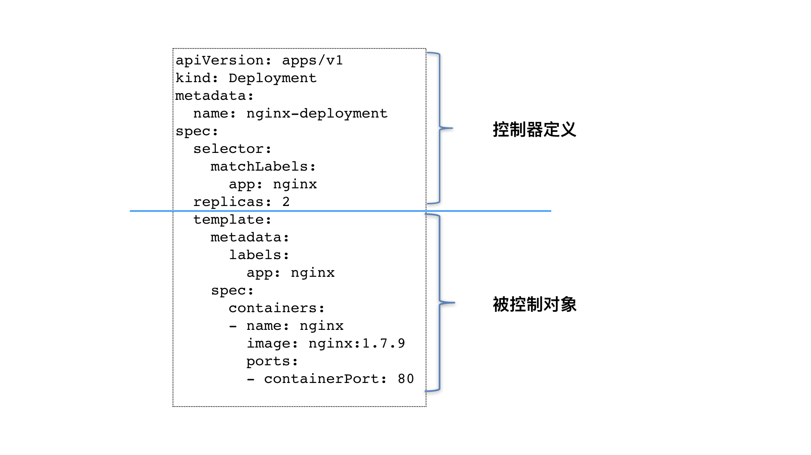

Pod 这个看似复杂的 API 对象，实际上就是对容器的进一步抽象和封装而已。

```yaml

apiVersion: apps/v1
kind: Deployment
metadata:
  name: nginx-deployment
spec:
  selector:
    matchLabels:
      app: nginx
  replicas: 2
  template:
    metadata:
      labels:
        app: nginx
    spec:
      containers:
      - name: nginx
        image: nginx:1.7.9
        ports:
        - containerPort: 80
```
这个 Deployment 定义的编排动作非常简单，即：确保携带了 app=nginx 标签的 Pod 的个数，永远等于 spec.replicas 指定的个数，即 2 个。这就意味着，如果在这个集群中，携带 app=nginx 标签的 Pod 的个数大于 2 的时候，就会有旧的 Pod 被删除；反之，就会有新的 Pod 被创建。

究竟是 Kubernetes 项目中的哪个组件，在执行这些操作呢？
kube-controller-manager 的组件

```

$ cd kubernetes/pkg/controller/
$ ls -d */
deployment/             job/                    podautoscaler/
cloud/                  disruption/             namespace/
replicaset/             serviceaccount/         volume/
cronjob/                garbagecollector/       nodelifecycle/          replication/            statefulset/            daemon/
...
```
这个目录下面的每一个控制器，都以独有的方式负责某种编排功能。而我们的 Deployment，正是这些控制器中的一种。

实际上，这些控制器之所以被统一放在 pkg/controller 目录下，就是因为它们都遵循 Kubernetes 项目中的一个通用编排模式，即：控制循环（control loop）。

```

for {
  实际状态 := 获取集群中对象X的实际状态（Actual State）
  期望状态 := 获取集群中对象X的期望状态（Desired State）
  if 实际状态 == 期望状态{
    什么都不做
  } else {
    执行编排动作，将实际状态调整为期望状态
  }
}
```

在具体实现中，实际状态往往来自于 Kubernetes 集群本身。
而期望状态，一般来自于用户提交的 YAML 文件。

一个 Kubernetes 对象的主要编排逻辑，实际上是在第三步的“对比”阶段完成的。这个操作，通常被叫作调谐（Reconcile）。这个调谐的过程，则被称作“Reconcile Loop”（调谐循环）或者“Sync Loop”（同步循环）。

像 Deployment 定义的 template 字段，在 Kubernetes 项目中有一个专有的名字，叫作 PodTemplate（Pod 模板）。


如上图所示，类似 Deployment 这样的一个控制器，实际上都是由上半部分的控制器定义（包括期望状态），加上下半部分的被控制对象的模板组成的。

>问题：你能否说出，Kubernetes 使用的这个“控制器模式”，跟我们平常所说的“事件驱动”，有什么区别和联系吗？
## 发现精选留言
>除了上面朋友提到的主动与被动区别，事件往往是一次性的，如果操作失败比较难处理，但是控制器是循环一直在尝试的，更符合kubernetes申明式API，最终达到与申明一致，这样理解对吗
>作者回复: 厉害。这个就说到点子上了。

>相当于select和epoll的区别
