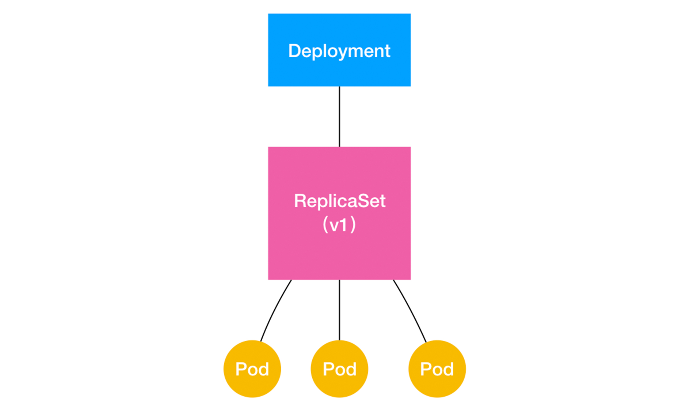

## 经典 PaaS 的记忆之作业副本与水平扩展

Kubernetes 里第一个控制器模式的完整实现：Deployment。

Deployment 看似简单，但实际上，它实现了 Kubernetes 项目中一个非常重要的功能：Pod 的“水平扩展 / 收缩”（horizontal scaling out/in）。这个功能，是从 PaaS 时代开始，一个平台级项目就必须具备的编排能力。

，如果你更新了 Deployment 的 Pod 模板（比如，修改了容器的镜像），那么 Deployment 就需要遵循一种叫作“滚动更新”（rolling update）的方式，来升级现有的容器。

而这个能力的实现，依赖的是 Kubernetes 项目中的一个非常重要的概念（API 对象）：ReplicaSet。

```yaml

apiVersion: apps/v1
kind: ReplicaSet
metadata:
  name: nginx-set
  labels:
    app: nginx
spec:
  replicas: 3
  selector:
    matchLabels:
      app: nginx
  template:
    metadata:
      labels:
        app: nginx
    spec:
      containers:
      - name: nginx
        image: nginx:1.7.9
```

一个 ReplicaSet 对象，其实就是由副本数目的定义和一个 Pod 模板组成的。

更重要的是，Deployment 控制器实际操纵的，正是这样的 ReplicaSet 对象，而不是 Pod 对象。

>问题：对于一个 Deployment 所管理的 Pod，它的 ownerReference 是谁？
这个问题的答案就是：ReplicaSet。

```yaml

apiVersion: apps/v1
kind: Deployment
metadata:
  name: nginx-deployment
  labels:
    app: nginx
spec:
  replicas: 3
  selector:
    matchLabels:
      app: nginx
  template:
    metadata:
      labels:
        app: nginx
    spec:
      containers:
      - name: nginx
        image: nginx:1.7.9
        ports:
        - containerPort: 80
```



ReplicaSet 负责通过“控制器模式”，保证系统中 Pod 的个数永远等于指定的个数（比如，3 个）。**这也正是 Deployment 只允许容器的 restartPolicy=Always** 的主要原因：只有在容器能保证自己始终是 Running 状态的前提下，ReplicaSet 调整 Pod 的个数才有意义。

“水平扩展 / 收缩”非常容易实现，Deployment Controller 只需要修改它所控制的 ReplicaSet 的 Pod 副本个数就可以了。比如，把这个值从 3 改成 4，那么 Deployment 所对应的 ReplicaSet，就会根据修改后的值自动创建一个新的 Pod。这就是“水平扩展”了；“水平收缩”则反之。而用户想要执行这个操作的指令也非常简单，就是 kubectl scale，比如：

```
$ kubectl scale deployment nginx-deployment --replicas=4
deployment.apps/nginx-deployment scaled
```

>“滚动更新”又是什么意思，是如何实现的呢？
创建这个 nginx-deployment：


```
$ kubectl create -f nginx-deployment.yaml --record


$ kubectl get deployments
NAME               DESIRED   CURRENT   UP-TO-DATE   AVAILABLE   AGE
nginx-deployment   3         0         0            0           1s
```


在返回结果中，我们可以看到四个状态字段，它们的含义如下所示。
* DESIRED：用户期望的 Pod 副本个数（spec.replicas 的值）；
* CURRENT：当前处于 Running 状态的 Pod 的个数；
* UP-TO-DATE：当前处于最新版本的 Pod 的个数，所谓最新版本指的是 Pod 的 Spec 部分与 Deployment 里 Pod 模板里定义的完全一致；
* AVAILABLE：当前已经可用的 Pod 的个数，即：既是 Running 状态，又是最新版本，并且已经处于 Ready（健康检查正确）状态的 Pod 的个数。可以看到，只有这个 AVAILABLE 字段，描述的才是用户所期望的最终状态。


Kubernetes 项目还为我们提供了一条指令，让我们可以实时查看 Deployment 对象的状态变化。这个指令就是 kubectl rollout status：

```
$ kubectl rollout status deployment/nginx-deployment
Waiting for rollout to finish: 2 out of 3 new replicas have been updated...
deployment.apps/nginx-deployment successfully rolled out
```

“2 out of 3 new replicas have been updated”意味着已经有 2 个 Pod 进入了 UP-TO-DATE 状态。

```

NAME               DESIRED   CURRENT   UP-TO-DATE   AVAILABLE   AGE
nginx-deployment   3         3         3            3           20s


$ kubectl get rs
NAME                          DESIRED   CURRENT   READY   AGE
nginx-deployment-3167673210   3         3         3       20s
```

如果我们修改了 Deployment 的 Pod 模板，“滚动更新”就会被自动触发。

```

$ kubectl edit deployment/nginx-deployment
...
    spec:
      containers:
      - name: nginx
        image: nginx:1.9.1 # 1.7.9 -> 1.9.1
        ports:
        - containerPort: 80
...
deployment.extensions/nginx-deployment edited
```

```

$ kubectl rollout status deployment/nginx-deployment
Waiting for rollout to finish: 2 out of 3 new replicas have been updated...
deployment.extensions/nginx-deployment successfully rolled out
```

你可以通过查看 Deployment 的 Events，看到这个“滚动更新”的流程：

```

$ kubectl describe deployment nginx-deployment
...
Events:
  Type    Reason             Age   From                   Message
  ----    ------             ----  ----                   -------
...
  Normal  ScalingReplicaSet  24s   deployment-controller  Scaled up replica set nginx-deployment-1764197365 to 1
  Normal  ScalingReplicaSet  22s   deployment-controller  Scaled down replica set nginx-deployment-3167673210 to 2
  Normal  ScalingReplicaSet  22s   deployment-controller  Scaled up replica set nginx-deployment-1764197365 to 2
  Normal  ScalingReplicaSet  19s   deployment-controller  Scaled down replica set nginx-deployment-3167673210 to 1
  Normal  ScalingReplicaSet  19s   deployment-controller  Scaled up replica set nginx-deployment-1764197365 to 3
  Normal  ScalingReplicaSet  14s   deployment-controller  Scaled down replica set nginx-deployment-3167673210 to 0
```

在这个“滚动更新”过程完成之后，你可以查看一下新、旧两个 ReplicaSet 的最终状态：

```

$ kubectl get rs
NAME                          DESIRED   CURRENT   READY   AGE
nginx-deployment-1764197365   3         3         3       6s
nginx-deployment-3167673210   0         0         0       30s
```

```yaml

apiVersion: apps/v1
kind: Deployment
metadata:
  name: nginx-deployment
  labels:
    app: nginx
spec:
...
  strategy:
    type: RollingUpdate
    rollingUpdate:
      maxSurge: 1
      maxUnavailable: 1
```

在上面这个 RollingUpdateStrategy 的配置中，maxSurge 指定的是除了 DESIRED 数量之外，在一次“滚动”中，Deployment 控制器还可以创建多少个新 Pod；而 maxUnavailable 指的是，在一次“滚动”中，Deployment 控制器可以删除多少个旧 Pod。同时，这两个配置还可以用前面我们介绍的百分比形式来表示，比如：maxUnavailable=50%，指的是我们最多可以一次删除“50%*DESIRED 数量”个 Pod。

kubectl set image 的指令，直接修改 nginx-deployment 所使用的镜像。这个命令的好处就是，你可以不用像 kubectl edit 那样需要打开编辑器。

```
$ kubectl set image deployment/nginx-deployment nginx=nginx:1.91
deployment.extensions/nginx-deployment image updated
```

我们只需要执行一条 kubectl rollout undo 命令，就能把整个 Deployment 回滚到上一个版本：
```

$ kubectl rollout undo deployment/nginx-deployment
deployment.extensions/nginx-deployment
```

首先，我需要使用 kubectl rollout history 命令，查看每次 Deployment 变更对应的版本。而由于我们在创建这个 Deployment 的时候，指定了–record 参数，所以我们创建这些版本时执行的 kubectl 命令，都会被记录下来。这个操作的输出如下所示：
```

$ kubectl rollout history deployment/nginx-deployment
deployments "nginx-deployment"
REVISION    CHANGE-CAUSE
1           kubectl create -f nginx-deployment.yaml --record
2           kubectl edit deployment/nginx-deployment
3           kubectl set image deployment/nginx-deployment nginx=nginx:1.91
```

你还可以通过这个 kubectl rollout history 指令，看到每个版本对应的 Deployment 的 API 对象的细节，具体命令如下所示：

```

$ kubectl rollout history deployment/nginx-deployment --revision=2

```

然后，我们就可以在 kubectl rollout undo 命令行最后，加上要回滚到的指定版本的版本号，就可以回滚到指定版本了。这个指令的用法如下：

```

$ kubectl rollout undo deployment/nginx-deployment --to-revision=2
deployment.extensions/nginx-deployment
```

```

$ kubectl rollout pause deployment/nginx-deployment
deployment.extensions/nginx-deployment paused

```
这个 kubectl rollout pause 的作用，是让这个 Deployment 进入了一个“暂停”状态。所以接下来，你就可以随意使用 kubectl edit 或者 kubectl set image 指令，修改这个 Deployment 的内容了。由于此时 Deployment 正处于“暂停”状态，所以我们对 Deployment 的所有修改，都不会触发新的“滚动更新”，也不会创建新的 ReplicaSet。而等到我们对 Deployment 修改操作都完成之后，只需要再执行一条 kubectl rollout resume 指令，就可以把这个 Deployment“恢复”回来，如下所示：
```

$ kubectl rollout resume deploy/nginx-deployment
deployment.extensions/nginx-deployment resumed
```
而在这个 kubectl rollout resume 指令执行之前，在 kubectl rollout pause 指令之后的这段时间里，我们对 Deployment 进行的所有修改，最后只会触发一次“滚动更新”。

通过返回结果，我们可以看到，只有一个 hash=3196763511 的 ReplicaSet 被创建了出来。

不过，即使你像上面这样小心翼翼地控制了 ReplicaSet 的生成数量，随着应用版本的不断增加，Kubernetes 中还是会为同一个 Deployment 保存很多很多不同的 ReplicaSet。那么，我们又该如何控制这些“历史”ReplicaSet 的数量呢？很简单，Deployment 对象有一个字段，叫作 spec.revisionHistoryLimit，就是 Kubernetes 为 Deployment 保留的“历史版本”个数。所以，如果把它设置为 0，你就再也不能做回滚操作了。

实现金丝雀发布、蓝绿发布，以及 A/B 测试等很多应用发布模式https://github.com/ContainerSolutions/k8s-deployment-strategies/tree/master/canary
