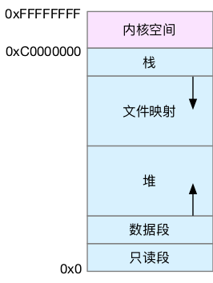

## 内存映射
Linux 内核给每个进程都提供了一个独立的虚拟地址空间，并且这个地址空间是连续的。这样，进程就可以很方便地访问内存，更确切地说是访问虚拟内存。虚拟地址空间的内部又被分为内核空间和用户空间两部分

内存映射，其实就是将虚拟内存地址映射到物理内存地址。为了完成内存映射，内核为每个进程都维护了一张页表，记录虚拟地址与物理地址的映射关系
页表实际上存储在 CPU 的内存管理单元 MMU 中，这样，正常情况下，处理器就可以直接通过硬件，找出要访问的内存。
而当进程访问的虚拟地址在页表中查不到时，系统会产生一个缺页异常，进入内核空间分配物理内存、更新进程页表，最后再返回用户空间，恢复进程的运行。

## 虚拟内存空间分布

用户空间内存
1. 只读段，包括代码和常量等。
2. 数据段，包括全局变量等。
3. 堆，包括动态分配的内存，从低地址开始向上增长。
4. 文件映射段，包括动态库、共享内存等，从高地址开始向下增长。
5. 栈，包括局部变量和函数调用的上下文等。栈的大小是固定的，一般是 8 MB。

## 内存分配与回收
malloc() 是 C 标准库提供的内存分配函数，对应到系统调用上，有两种实现方式，即 brk() 和 mmap()。
对小块内存（小于 128K），C 标准库使用 brk() 来分配，也就是通过移动堆顶的位置来分配内存。这些内存释放后并不会立刻归还系统，而是被缓存起来，这样就可以重复使用。
而大块内存（大于 128K），则直接使用内存映射 mmap() 来分配，也就是在文件映射段找一块空闲内存分配出去。
当这两种调用发生后，其实**并没有真正分配内存**。这些内存，都只在首次访问时才分配，也就是通过缺页异常进入内核中，再由内核来分配内存。

在发现内存紧张时，系统就会通过一系列机制来回收内存，比如下面这三种方式：
1. 回收缓存，比如使用 LRU（Least Recently Used）算法，回收最近使用最少的内存页面；
2. 回收不常访问的内存，把不常用的内存通过交换分区直接写到磁盘中；
3. 杀死进程，内存紧张时系统还会通过 OOM（Out of Memory），直接杀掉占用大量内存的进程。

第三种方式提到的  OOM（Out of Memory），其实是内核的一种保护机制。它监控进程的内存使用情况，并且使用 oom_score 为每个进程的内存使用情况进行评分：
* 一个进程消耗的内存越大，oom_score 就越大；
* 一个进程运行占用的 CPU 越多，oom_score 就越小。

oom_adj 的范围是 [-17, 15]，数值越大，表示进程越容易被 OOM 杀死；数值越小，表示进程越不容易被 OOM 杀死，其中 -17 表示禁止 OOM。
比如用下面的命令，你就可以把 sshd 进程的 oom_adj 调小为 -16，这样， sshd 进程就不容易被 OOM 杀死。
```
echo -16 > /proc/$(pidof sshd)/oom_adj
```

## 如何查看内存使用情况
```
# 注意不同版本的free输出可能会有所不同
$ free
              total        used        free      shared  buff/cache   available
Mem:        8169348      263524     6875352         668     1030472     7611064
Swap:             0           0           0
```
* 第一列，total 是总内存大小；
* 第二列，used 是已使用内存的大小，**包含了共享内存**；
* 第三列，free 是未使用内存的大小；
* 第四列，shared 是共享内存的大小；
* 第五列，buff/cache 是缓存和缓冲区的大小；
* 最后一列，available 是新进程可用内存的大小。(available 不仅包含未使用内存，还包括了可回收的缓存，所以一般会比未使用内存更大。不过，并不是所有缓存都可以回收，因为有些缓存可能正在使用中。)

free 显示的是整个系统的内存使用情况。如果你想查看进程的内存使用情况，可以用 top 或者 ps 等工具。
```

# 按下M切换到内存排序
$ top
...
KiB Mem :  8169348 total,  6871440 free,   267096 used,  1030812 buff/cache
KiB Swap:        0 total,        0 free,        0 used.  7607492 avail Mem


  PID USER      PR  NI    VIRT    RES    SHR S  %CPU %MEM     TIME+ COMMAND
  430 root      19  -1  122360  35588  23748 S   0.0  0.4   0:32.17 systemd-journal
 1075 root      20   0  771860  22744  11368 S   0.0  0.3   0:38.89 snapd
 1048 root      20   0  170904  17292   9488 S   0.0  0.2   0:00.24 networkd-dispat
    1 root      20   0   78020   9156   6644 S   0.0  0.1   0:22.92 systemd
12376 azure     20   0   76632   7456   6420 S   0.0  0.1   0:00.01 systemd
12374 root      20   0  107984   7312   6304 S   0.0  0.1   0:00.00 sshd
...
```
* VIRT 是进程虚拟内存的大小，只要是进程申请过的内存，即便还没有真正分配物理内存，也会计算在内。
* RES 是常驻内存的大小，也就是进程实际使用的物理内存大小，但**不包括 Swap 和共享内存**。
* SHR 是共享内存的大小，比如与其他进程共同使用的共享内存、加载的动态链接库以及程序的代码段等。
* %MEM 是进程使用物理内存占系统总内存的百分比。

查看 top 输出时，还要注意两点。
* 第一，虚拟内存通常并不会全部分配物理内存。从上面的输出，你可以发现每个进程的虚拟内存都比常驻内存大得多。
* 第二，共享内存 SHR 并不一定是共享的，比方说，程序的代码段、非共享的动态链接库，也都算在 SHR 里。当然，SHR 也包括了进程间真正共享的内存。所以在计算多个进程的内存使用时，不要把所有进程的 SHR 直接相加得出结果。

小结
* 对普通进程来说，它能看到的其实是内核提供的虚拟内存，这些虚拟内存还需要通过页表，由系统映射为物理内存。
* 由于进程的虚拟地址空间比物理内存大很多，Linux 还提供了一系列的机制，应对内存不足的问题，比如缓存的回收、交换分区 Swap 以及 OOM 等。

## 发现精选留言
>目前我配合使用《Operating System Concepts》这本书学习此专栏，也是一个不错的选择。此书中的第四部分“Memory Management”对今天这部分内容有较为详细的描述，感兴趣的同学可以去看一下。另外对于TOP命令中输出的内存情况解释，可以认真看一下man手册的内容。如果你动手能力比较强，可以看https://blog.holbertonschool.com/hack-the-virtual-memory-malloc-the-heap-the-program-break/这篇博客，手把手教你使用程序（C语言）来实际地去搞清楚虚拟内存分布。
备注：很详细mark

>1、调用c标准库的都是用户空间的调用，用户空间的内存分配都是基于buddy算法（伙伴算法），并不涉及slab
>2、brk()方式之所以会产生内存碎片，是由于brk分配的内存是推_edata指针，从堆的低地址向高地址推进。这种情况下，如果高地址的内存不释放，低地址的内存是得不到释放的
>3、mmap()方式分配的内存，是在堆与栈之间的空闲区域分配虚拟内存，直接拿到的是内存地址，可以直接操作内存的释放
>上述的都是在用户空间发生的行为，只有在内核空间，内核调用kmalloc去分配内存的时候，才会涉及到slab
备注：解释了内存碎片原因
[内存碎片的定义](https://baike.baidu.com/item/%E5%86%85%E5%AD%98%E7%A2%8E%E7%89%87),[Buddy&Slab](https://zhuanlan.zhihu.com/p/36140017),[brk&map](https://www.cnblogs.com/vinozly/p/5489138.html)
