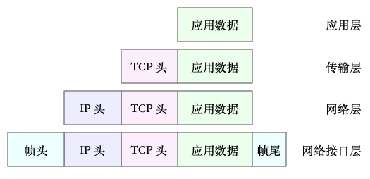

## 网络模型
>开放式系统互联通信参考模型（Open System Interconnection Reference Model），简称为 OSI 网络模型

OSI 模型还是太复杂了，也没能提供一个可实现的方法。所以，在 Linux 中，我们实际上使用的是另一个更实用的四层模型，即 TCP/IP 网络模型。
TCP/IP 模型，把网络互联的框架分为应用层、传输层、网络层、网络接口层等四层，其中，
* 应用层，负责向用户提供一组应用程序，比如 HTTP、FTP、DNS 等。
* 传输层，负责端到端的通信，比如 TCP、UDP 等。
* 网络层，负责网络包的封装、寻址和路由，比如 IP、ICMP 等。
* 网络接口层，负责网络包在物理网络中的传输，比如 MAC 寻址、错误侦测以及通过网卡传输网络帧等。

虽说 Linux 实际按照 TCP/IP 模型，实现了网络协议栈，但在平时的学习交流中，我们习惯上还是用 OSI 七层模型来描述。比如，说到七层和四层负载均衡，对应的分别是 OSI 模型中的应用层和传输层（而它们对应到 TCP/IP 模型中，实际上是四层和三层）。

>《TCP/IP 详解》的卷一和卷二

## Linux 网络栈

* 传输层在应用程序数据前面增加了 TCP 头；
* 网络层在 TCP 数据包前增加了 IP 头；
* 而网络接口层，又在 IP 数据包前后分别增加了帧头和帧尾。

[查看协议的文档](https://zh.wikipedia.org/wiki/%E4%BC%A0%E8%BE%93%E6%8E%A7%E5%88%B6%E5%8D%8F%E8%AE%AE#%E5%B0%81%E5%8C%85%E7%B5%90%E6%A7%8B)

### Linux 内核中的网络栈

* 最上层的应用程序，需要通过系统调用，来跟套接字接口进行交互；
* 套接字的下面，就是我们前面提到的传输层、网络层和网络接口层；
* 最底层，则是网卡驱动程序以及物理网卡设备。

网卡是发送和接收网络包的基本设备。在系统启动过程中，网卡通过内核中的网卡驱动程序注册到系统中。而在网络收发过程中，内核通过中断跟网卡进行交互。再结合前面提到的 Linux 网络栈，可以看出，网络包的处理非常复杂。所以，网卡硬中断只处理最核心的网卡数据读取或发送，而协议栈中的大部分逻辑，都会放到软中断中处理。

## 网络包的接收流程
当一个网络帧到达网卡后，网卡会通过 DMA 方式，把这个网络包放到收包队列中；然后通过硬中断，告诉中断处理程序已经收到了网络包。接着，网卡中断处理程序会为网络帧分配内核数据结构（sk_buff），并将其拷贝到 sk_buff 缓冲区中；然后再通过软中断，通知内核收到了新的网络帧。

## 网络包的发送流程
应用程序调用 Socket API（比如 sendmsg）发送网络包。
由于这是一个系统调用，所以会陷入到内核态的套接字层中。套接字层会把数据包放到 Socket 发送缓冲区中。
接下来，网络协议栈从 Socket 发送缓冲区中，取出数据包；再按照 TCP/IP 栈，从上到下逐层处理。比如，传输层和网络层，分别为其增加 TCP 头和 IP 头，执行路由查找确认下一跳的 IP，并按照 MTU 大小进行分片。
分片后的网络包，再送到网络接口层，进行物理地址寻址，以找到下一跳的 MAC 地址。然后添加帧头和帧尾，放到发包队列中。这一切完成后，会有软中断通知驱动程序：发包队列中有新的网络帧需要发送。
最后，驱动程序通过 DMA ，从发包队列中读出网络帧，并通过物理网卡把它发送出去。
