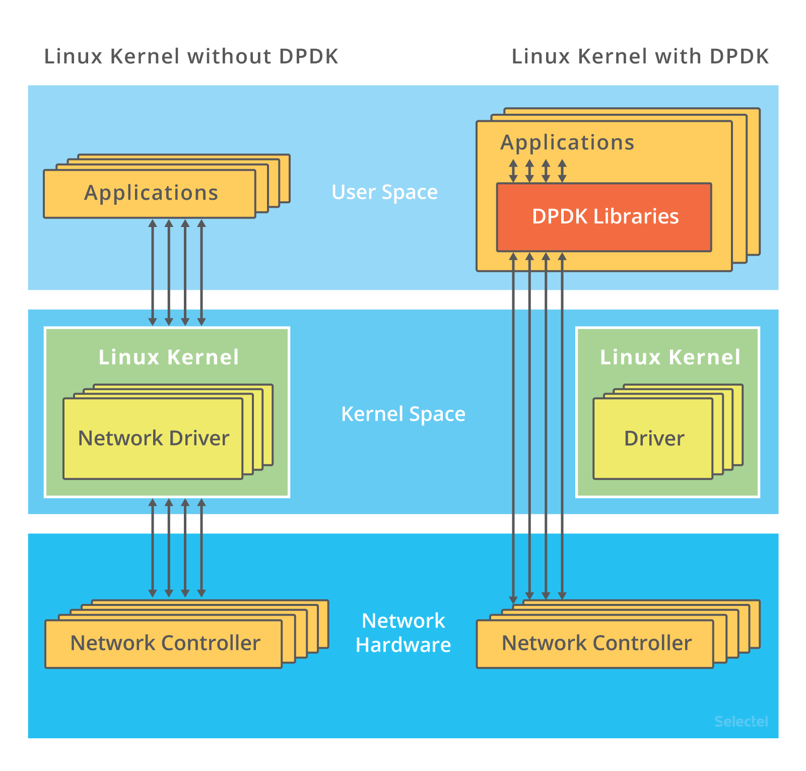

## C10K
怎么在这样的系统中支持并发 1 万的请求呢？
从资源上来说，对 2GB 内存和千兆网卡的服务器来说，同时处理 10000 个请求，只要每个请求处理占用不到 200KB（2GB/10000）的内存和 100Kbit （1000Mbit/10000）的网络带宽就可以。所以，物理资源是足够的，接下来自然是软件的问题，特别是网络的 I/O 模型问题。
说到 I/O 的模型，我在文件系统的原理中，曾经介绍过文件 I/O，其实网络 I/O 模型也类似。在 C10K 以前，Linux 中网络处理都用同步阻塞的方式，也就是每个请求都分配一个进程或者线程。请求数只有 100 个时，这种方式自然没问题，但增加到 10000 个请求时，10000 个进程或线程的调度、上下文切换乃至它们占用的内存，都会成为瓶颈。

### I/O 模型优化
* 第一种，使用非阻塞 I/O 和水平触发通知，比如使用 select 或者 poll。
* 第二种，使用非阻塞 I/O 和边缘触发通知，比如 epoll。

epoll 使用红黑树，在内核中管理文件描述符的集合，这样，就不需要应用程序在每次操作时都传入、传出这个集合。epoll 使用事件驱动的机制，只关注有 I/O 事件发生的文件描述符，不需要轮询扫描整个集合。
epoll 是在 Linux 2.6 中才新增的功能（2.4 虽然也有，但功能不完善）。
* 第三种，使用异步 I/O（Asynchronous I/O，简称为 AIO）。

异步 I/O 也是到了 Linux 2.6 才支持的功能

### 工作模型优化
第一种，主进程 + 多个 worker 子进程，这也是最常用的一种模型。

accept() 和 epoll_wait() 调用，还存在一个惊群的问题。换句话说，当网络 I/O 事件发生时，多个进程被同时唤醒，但实际上只有一个进程来响应这个事件，其他被唤醒的进程都会重新休眠。
其中，accept() 的惊群问题，已经在 Linux 2.6 中解决了；而 epoll 的问题，到了 Linux 4.5 ，才通过 EPOLLEXCLUSIVE 解决。
为了避免惊群问题， Nginx 在每个 worker 进程中，都增加一个了全局锁（accept_mutex）。这些 worker 进程需要首先竞争到锁，只有竞争到锁的进程，才会加入到 epoll 中，这样就确保只有一个 worker 子进程被唤醒。
不过，根据前面 CPU 模块的学习，你应该还记得，进程的管理、调度、上下文切换的成本非常高。那为什么使用多进程模式的 Nginx ，却具有非常好的性能呢？这里最主要的一个原因就是，这些 worker 进程，实际上并不需要经常创建和销毁，而是在没任务时休眠，有任务时唤醒。只有在 worker 由于某些异常退出时，主进程才需要创建新的进程来代替它。

第二种，监听到相同端口的多进程模型。在这种方式下，所有的进程都监听相同的接口，并且开启 SO_REUSEPORT 选项，由内核负责将请求负载均衡到这些监听进程中去。这一过程如下图所示。

由于内核确保了只有一个进程被唤醒，就不会出现惊群问题了。比如，Nginx 在 1.9.1 中就已经支持了这种模式。

不过要注意，想要使用 SO_REUSEPORT 选项，需要用 Linux 3.9 以上的版本才可以。

## C1000K
首先从物理资源使用上来说，100 万个请求需要大量的系统资源。比如，假设每个请求需要 16KB 内存的话，那么总共就需要大约 15 GB 内存。而从带宽上来说，假设只有 20% 活跃连接，即使每个连接只需要 1KB/s 的吞吐量，总共也需要 1.6 Gb/s 的吞吐量。千兆网卡显然满足不了这么大的吞吐量，所以还需要配置万兆网卡，或者基于多网卡 Bonding 承载更大的吞吐量。
其次，从软件资源上来说，大量的连接也会占用大量的软件资源，比如文件描述符的数量、连接状态的跟踪（CONNTRACK）、网络协议栈的缓存大小（比如套接字读写缓存、TCP 读写缓存）等等。
最后，大量请求带来的中断处理，也会带来非常高的处理成本。这样，就需要多队列网卡、中断负载均衡、CPU 绑定、RPS/RFS（软中断负载均衡到多个 CPU 核上），以及将网络包的处理卸载（Offload）到网络设备（如 TSO/GSO、LRO/GRO、VXLAN OFFLOAD）等各种硬件和软件的优化。
C1000K 的解决方法，本质上还是构建在 epoll 的非阻塞 I/O 模型上。只不过，除了 I/O 模型之外，还需要从应用程序到 Linux 内核、再到 CPU、内存和网络等各个层次的深度优化，特别是需要借助硬件，来卸载那些原来通过软件处理的大量功能。

## C10M
究其根本，还是 Linux 内核协议栈做了太多太繁重的工作。从网卡中断带来的硬中断处理程序开始，到软中断中的各层网络协议处理，最后再到应用程序，这个路径实在是太长了，就会导致网络包的处理优化，到了一定程度后，就无法更进一步了。要解决这个问题，最重要就是跳过内核协议栈的冗长路径，把网络包直接送到要处理的应用程序那里去。这里有两种常见的机制，DPDK 和 XDP。
第一种机制，DPDK，是用户态网络的标准。它跳过内核协议栈，直接由用户态进程通过轮询的方式，来处理网络接收。

说起轮询，你肯定会下意识认为它是低效的象征，但是进一步反问下自己，它的低效主要体现在哪里呢？是查询时间明显多于实际工作时间的情况下吧！那么，换个角度来想，如果每时每刻都有新的网络包需要处理，轮询的优势就很明显了。比如：在 PPS 非常高的场景中，查询时间比实际工作时间少了很多，绝大部分时间都在处理网络包；而跳过内核协议栈后，就省去了繁杂的硬中断、软中断再到 Linux 网络协议栈逐层处理的过程，应用程序可以针对应用的实际场景，有针对性地优化网络包的处理逻辑，而不需要关注所有的细节。此外，DPDK 还通过大页、CPU 绑定、内存对齐、流水线并发等多种机制，优化网络包的处理效率。

第二种机制，XDP（eXpress Data Path），则是 Linux 内核提供的一种高性能网络数据路径。它允许网络包，在进入内核协议栈之前，就进行处理，也可以带来更高的性能。XDP 底层跟我们之前用到的 bcc-tools 一样，都是基于 Linux 内核的 eBPF 机制实现的。

你可以看到，XDP 对内核的要求比较高，需要的是 Linux 4.8 以上版本，并且它也不提供缓存队列。基于 XDP 的应用程序通常是专用的网络应用，常见的有 IDS（入侵检测系统）、DDoS 防御、 cilium 容器网络插件等。

## 小结
C10K 问题的根源，一方面在于系统有限的资源；另一方面，也是更重要的因素，是同步阻塞的 I/O 模型以及轮询的套接字接口，限制了网络事件的处理效率。Linux 2.6 中引入的 epoll ，完美解决了 C10K 的问题，现在的高性能网络方案都基于 epoll。
从 C10K 到 C100K ，可能只需要增加系统的物理资源就可以满足；但从 C100K 到 C1000K ，就不仅仅是增加物理资源就能解决的问题了。这时，就需要多方面的优化工作了，从硬件的中断处理和网络功能卸载、到网络协议栈的文件描述符数量、连接状态跟踪、缓存队列等内核的优化，再到应用程序的工作模型优化，都是考虑的重点。
再进一步，要实现 C10M ，就不只是增加物理资源，或者优化内核和应用程序可以解决的问题了。这时候，就需要用 XDP 的方式，在内核协议栈之前处理网络包；或者用 DPDK 直接跳过网络协议栈，在用户空间通过轮询的方式直接处理网络包。
当然了，实际上，在大多数场景中，我们并不需要单机并发 1000 万的请求。通过调整系统架构，把这些请求分发到多台服务器中来处理，通常是更简单和更容易扩展的方案。

## 发现精选留言
>一台机器不是只有65536个端口吗，每个网络请求都需要消耗一个端口，这样大于65536个请求会不会导致端口不够用呢？
>作者回复: 如果是只有一个IP地址的客户端，那的确是受限于端口数量。不过，如果是服务器端，那可以接受的连接就多得多了（组合客户端IP+端口）。
>作者回复: 注意区分客户端还是服务器端：客户端使用单个IP去访问服务器的时候，端口号数是最大限制；服务器端没有这个限制。

>09年那会,我所在公司的服务器端都是单进程+select.后来把select换为了poll和epoll.再后来还拆分成了多进程,N个网络收发层+M个业务处理层.毕竟我们的情况是 业务处理的耗时远大于网络收发的耗时.目前的网络收发层也只支持最大65530个并发连接,毕竟是单ip单端口的.如果想支持更多并发连接,就另外再开一个进程.并没有往C100K甚至是C1000K的方向上努力了.
>作者回复: 其实并不是 65530，Linux使用五元组标志一个连接：协议、源IP、源端口、目的IP、目的端口。根据这些，你可以算下理论上最大支持的连接数。

>没碰到单机一千万这么夸张的场景，想问下一千万连接这种场景下，一般机器是什么配置呢按这么发展下去，以后会不会出现单机1亿连接，那样的话所有处理都得硬件来完成了吧
>作者回复: 这在流量集中的场景是需要的，比如网关或者流量清洗这种安全系统上

>想问一下c10,c1000k,c10m这些都是基于什么服务器配置？比如怎么样的服务器实现了
>作者回复: c10k对服务器要求很低，甚至个人开发机都可以；c10m对硬件有一些要求，比如需要支持dpdk的网卡

>DPDK适合五元组比较集中的高pps请求模型，在没有复用五元组的情况下貌似支持下比较差。
>作者回复: 现在很多人也用DPDK来做负载均衡、软路由或流量清洗
