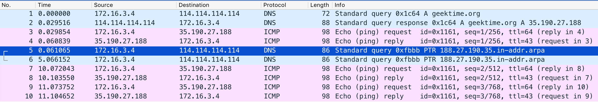
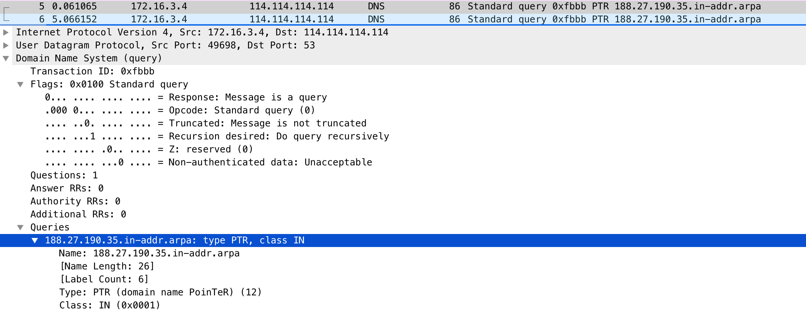
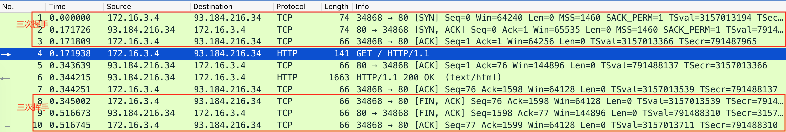
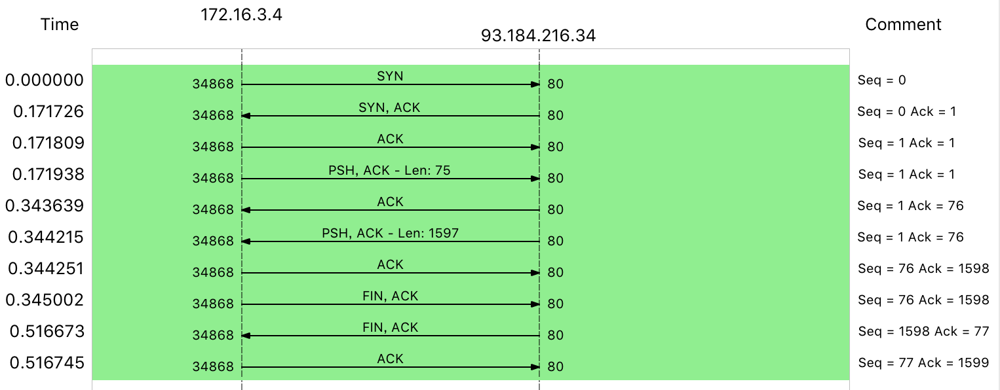
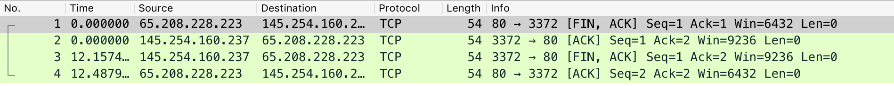

## 案例
tcpdump 和 Wireshark 就是最常用的网络抓包和分析工具，更是分析网络性能必不可少的利器。
* tcpdump 仅支持命令行格式使用，常用在服务器中抓取和分析网络包。
* Wireshark 除了可以抓包外，还提供了强大的图形界面和汇总分析工具，在分析复杂的网络情景时，尤为简单和实用。

因而，在实际分析网络性能时，先用 tcpdump 抓包，后用 Wireshark 分析，也是一种常用的方法。

```

# Ubuntu
apt-get install tcpdump wireshark

# CentOS
yum install -y tcpdump wireshark
```

## tcpdump
>《TCP/IP 详解》，特别是第一卷的 TCP/IP 协议族。这是每个程序员都要掌握的核心基础知识。


```
时间戳 协议 源地址.源端口 > 目的地址.目的端口 网络包详细信息
```
```
网络包的详细信息取决于协议，不同协议展示的格式也不同。所以，更详细的使用方法，还是需要你去查询 tcpdump 的 man 手册
man tcpdump
```

## Wireshark
```
$ tcpdump -nn udp port 53 or host 35.190.27.188 -w ping.pcap

$ scp host-ip/path/ping.pcap .38
```


从 Wireshark 的界面里，你可以发现，它不仅以更规整的格式，展示了各个网络包的头部信息；还用了不同颜色，展示 DNS 和 ICMP 这两种不同的协议。你也可以一眼看出，中间的两条 PTR 查询并没有响应包。

网络包列表中选择某一个网络包后，在其下方的网络包详情中，你还可以看到，这个包在协议栈各层的详细信息。比如，以编号为 5 的 PTR 包为例：


你可以看到，IP 层（Internet Protocol）的源地址和目的地址、传输层的 UDP 协议（Uder Datagram Protocol）、应用层的 DNS 协议（Domain Name System）的概要信息。继续点击每层左边的箭头，就可以看到该层协议头的所有信息。比如点击 DNS 后，就可以看到 Transaction ID、Flags、Queries 等 DNS 协议各个字段的数值以及含义。

## TCP 三次握手和四次挥手
```

$ dig +short example.com
93.184.216.34
$ tcpdump -nn host 93.184.216.34 -w web.pcap
```
```
curl http://example.com
```

由于 HTTP 基于 TCP ，所以你最先看到的三个包，分别是 TCP 三次握手的包。接下来，中间的才是 HTTP 请求和响应包，而最后的三个包，则是 TCP 连接断开时的三次挥手包。从菜单栏中，点击 Statistics -> Flow Graph，然后，在弹出的界面中的 Flow type 选择 TCP Flows，你可以更清晰的看到，整个过程中 TCP 流的执行过程：


其实，之所以有三个包，是因为服务器端收到客户端的 FIN 后，服务器端同时也要关闭连接，这样就可以把 ACK 和 FIN 合并到一起发送，节省了一个包，变成了“三次挥手”。而通常情况下，服务器端收到客户端的 FIN 后，很可能还没发送完数据，所以就会先回复客户端一个 ACK 包。稍等一会儿，完成所有数据包的发送后，才会发送 FIN 包。这也就是四次挥手了。


## 小结
根据 IP 地址反查域名、根据端口号反查协议名称，是很多网络工具默认的行为，而这往往会导致性能工具的工作缓慢。所以，通常，网络性能工具都会提供一个选项（比如 -n 或者 -nn），来禁止名称解析。

## 发现精选留言
>wireshark的使用推荐阅读林沛满的《Wireshark网络分析就这么简单》和《Wireshark网络分析的艺术》

>https://www.dell.com/community/%E6%95%B0%E6%8D%AE%E5%AD%98%E5%82%A8%E8%AE%A8%E8%AE%BA%E5%8C%BA/%E5%A6%82%E6%9E%9C%E7%9C%8B%E4%BA%86%E8%BF%99%E4%B8%AA%E4%BD%A0%E8%BF%98%E6%98%AF%E4%B8%8D%E4%BC%9A%E7%94%A8Wireshark-%E9%82%A3%E5%B0%B1%E6%9D%A5%E6%89%BE%E6%88%91%E5%90%A7-8%E6%9C%886%E6%97%A5%E5%AE%8C%E7%BB%93/td-p/7007033
