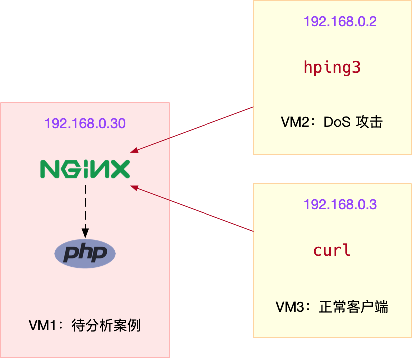
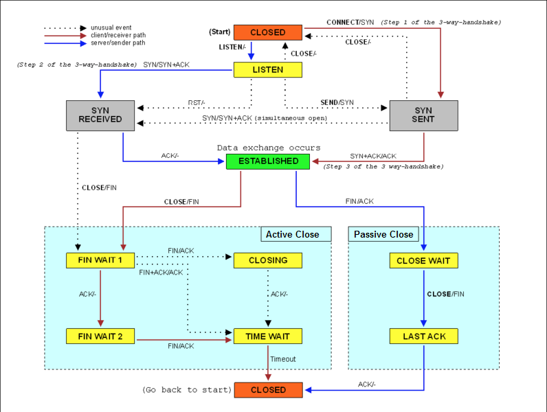

## DDoS 简介
DDoS 的前身是 DoS（Denail of Service），即拒绝服务攻击，指利用大量的合理请求，来占用过多的目标资源，从而使目标服务无法响应正常请求。DDoS（Distributed Denial of Service） 则是在 DoS 的基础上，采用了分布式架构，利用多台主机同时攻击目标主机。这样，即使目标服务部署了网络防御设备，面对大量网络请求时，还是无力应对。

DDoS 可以分为下面几种类型。
* 第一种，耗尽带宽。无论是服务器还是路由器、交换机等网络设备，带宽都有固定的上限。带宽耗尽后，就会发生网络拥堵，从而无法传输其他正常的网络报文。
* 第二种，耗尽操作系统的资源。网络服务的正常运行，都需要一定的系统资源，像是 CPU、内存等物理资源，以及连接表等软件资源。一旦资源耗尽，系统就不能处理其他正常的网络连接。
* 第三种，消耗应用程序的运行资源。应用程序的运行，通常还需要跟其他的资源或系统交互。如果应用程序一直忙于处理无效请求，也会导致正常请求的处理变慢，甚至得不到响应。

## 案例


```

# 运行Nginx服务并对外开放80端口
# --network=host表示使用主机网络（这是为了方便后面排查问题）
$ docker run -itd --name=nginx --network=host nginx
```

```

# -w表示只输出HTTP状态码及总时间，-o表示将响应重定向到/dev/null
$ curl -s -w 'Http code: %{http_code}\nTotal time:%{time_total}s\n' -o /dev/null http://192.168.0.30/
...
Http code: 200
Total time:0.002s
```

运行 hping3 命令，来模拟 DoS 攻击：
```

# -S参数表示设置TCP协议的SYN（同步序列号），-p表示目的端口为80
# -i u10表示每隔10微秒发送一个网络帧
$ hping3 -S -p 80 -i u10 192.168.0.30
```

```

# --connect-timeout表示连接超时时间
$ curl -w 'Http code: %{http_code}\nTotal time:%{time_total}s\n' -o /dev/null --connect-timeout 10 http://192.168.0.30
...
Http code: 000
Total time:10.001s
curl: (28) Connection timed out after 10000 milliseconds
```
正常客户端的连接超时了，并没有收到 Nginx 服务的响应。

检查网络状况。 sar，它既可以观察 PPS（每秒收发的报文数），还可以观察 BPS（每秒收发的字节数）。

```

$ sar -n DEV 1
08:55:49        IFACE   rxpck/s   txpck/s    rxkB/s    txkB/s   rxcmp/s   txcmp/s  rxmcst/s   %ifutil
08:55:50      docker0      0.00      0.00      0.00      0.00      0.00      0.00      0.00      0.00
08:55:50         eth0  22274.00    629.00   1174.64     37.78      0.00      0.00      0.00      0.02
08:55:50           lo      0.00      0.00      0.00      0.00      0.00      0.00      0.00      0.00
```
从这次 sar 的输出中，你可以看到，网络接收的 PPS 已经达到了 20000 多，但是 BPS 却只有 1174 kB，这样每个包的大小就只有 54B（1174*1024/22274=54）。这明显就是个小包了，不过具体是个什么样的包呢？那我们就用 tcpdump 抓包看看吧。

```

# -i eth0 只抓取eth0网卡，-n不解析协议名和主机名
# tcp port 80表示只抓取tcp协议并且端口号为80的网络帧
$ tcpdump -i eth0 -n tcp port 80
09:15:48.287047 IP 192.168.0.2.27095 > 192.168.0.30: Flags [S], seq 1288268370, win 512, length 0
09:15:48.287050 IP 192.168.0.2.27131 > 192.168.0.30: Flags [S], seq 2084255254, win 512, length 0
09:15:48.287052 IP 192.168.0.2.27116 > 192.168.0.30: Flags [S], seq 677393791, win 512, length 0
09:15:48.287055 IP 192.168.0.2.27141 > 192.168.0.30: Flags [S], seq 1276451587, win 512, length 0
09:15:48.287068 IP 192.168.0.2.27154 > 192.168.0.30: Flags [S], seq 1851495339, win 512, length 0
...
```
这个输出中，Flags [S] 表示这是一个 SYN 包。大量的 SYN 包表明，这是一个 SYN Flood 攻击。如果你用上一节讲过的 Wireshark 来观察，则可以更直观地看到 SYN Flood 的过程：

SYN Flood 正是互联网中最经典的 DDoS 攻击方式。原理：
* 即客户端构造大量的 SYN 包，请求建立 TCP 连接；
* 而服务器收到包后，会向源 IP 发送 SYN+ACK 报文，并等待三次握手的最后一次 ACK 报文，直到超时。
这种等待状态的 TCP 连接，通常也称为半开连接。由于连接表的大小有限，大量的半开连接就会导致连接表迅速占满，从而无法建立新的 TCP 连接。
参考下面这张 TCP 状态图，你能看到，此时，服务器端的 TCP 连接，会处于 SYN_RECEIVED 状态：



```

# -n表示不解析名字，-p表示显示连接所属进程
$ [netstat][3] -n -p | grep SYN_REC
tcp        0      0 192.168.0.30:80          192.168.0.2:12503      SYN_RECV    -
tcp        0      0 192.168.0.30:80          192.168.0.2:13502      SYN_RECV    -
tcp        0      0 192.168.0.30:80          192.168.0.2:15256      SYN_RECV    -
tcp        0      0 192.168.0.30:80          192.168.0.2:18117      SYN_RECV    -
...
```

```

$ netstat -n -p | grep SYN_REC | wc -l
193
```
找出源 IP 后，要解决 SYN 攻击的问题，只要丢掉相关的包就可以。这时，[iptables][1] 可以帮你完成这个任务。你可以在终端一中，执行下面的 iptables 命令：

```

$ iptables -I INPUT -s 192.168.0.2 -p tcp -j REJECT
```

```

$ curl -w 'Http code: %{http_code}\nTotal time:%{time_total}s\n' -o /dev/null --connect-timeout 10 http://192.168.0.30
Http code: 200
Total time:1.572171s
```
现在，你可以发现，正常用户也可以访问 Nginx 了，只是响应比较慢，从原来的 2ms 变成了现在的 1.5s。不过，一般来说，SYN Flood 攻击中的源 IP 并不是固定的。比如，你可以在 hping3 命令中，加入 --rand-source 选项，来随机化源 IP。不过，这时，刚才的方法就不适用了。

幸好，我们还有很多其他方法，实现类似的目标。比如，你可以用以下两种方法，来限制 syn 包的速率：
```

# 限制syn并发数为每秒1次
$ iptables -A INPUT -p tcp --syn -m limit --limit 1/s -j ACCEPT

# 限制单个IP在60秒新建立的连接数为10
$ iptables -I INPUT -p tcp --dport 80 --syn -m recent --name SYN_FLOOD --update --seconds 60 --hitcount 10 -j REJECT
```

如果是多台机器同时发送 SYN Flood，这种方法可能就直接无效了。因为你很可能无法 SSH 登录（SSH 也是基于 TCP 的）到机器上去

```
$ sysctl net.ipv4.tcp_max_syn_backlog
net.ipv4.tcp_max_syn_backlog = 256
```
应该增大半连接的容量，比如，你可以用下面的命令，将其增大为 1024：
```

$ sysctl -w net.ipv4.tcp_max_syn_backlog=1024
net.ipv4.tcp_max_syn_backlog = 1024
```

另外，连接每个 [SYN_RECV][4] 时，如果失败的话，内核还会自动重试，并且默认的重试次数是 5 次。你可以执行下面的命令，将其减小为 1 次：
```
$ sysctl -w net.ipv4.tcp_synack_retries=1
net.ipv4.tcp_synack_retries = 1
```

[TCP SYN Cookies][2] 也是一种专门防御 SYN Flood 攻击的方法。SYN Cookies 基于连接信息（包括源地址、源端口、目的地址、目的端口等）以及一个加密种子（如系统启动时间），计算出一个哈希值（SHA1），这个哈希值称为 cookie。然后，这个 cookie 就被用作序列号，来应答 SYN+ACK 包，并释放连接状态。当客户端发送完三次握手的最后一次 ACK 后，服务器就会再次计算这个哈希值，确认是上次返回的 SYN+ACK 的返回包，才会进入 TCP 的连接状态。

```

$ sysctl -w net.ipv4.tcp_syncookies=1
net.ipv4.tcp_syncookies = 1
```

注意，上述 sysctl 命令修改的配置都是临时的，重启后这些配置就会丢失。所以，为了保证配置持久化，你还应该把这些配置，写入 /etc/sysctl.conf 文件中。比如：
```

$ cat /etc/sysctl.conf
net.ipv4.tcp_syncookies = 1
net.ipv4.tcp_synack_retries = 1
net.ipv4.tcp_max_syn_backlog = 1024
```
注意，开启 TCP syncookies 后，内核选项 net.ipv4.tcp_max_syn_backlog 也就无效了。
不过要记得，写入 /etc/sysctl.conf 的配置，需要执行 sysctl -p 命令后，才会动态生效。

## 小结
由于 DDoS 的分布式、大流量、难追踪等特点，目前还没有方法可以完全防御 DDoS 带来的问题，只能设法缓解这个影响。比如，你可以购买专业的流量清洗设备和网络防火墙，在网络入口处阻断恶意流量，只保留正常流量进入数据中心的服务器中。在 Linux 服务器中，你可以通过内核调优、DPDK、XDP 等多种方法，来增大服务器的抗攻击能力，降低 DDoS 对正常服务的影响。而在应用程序中，你可以利用各级缓存、 WAF、CDN 等方式，缓解 DDoS 对应用程序的影响。

[1]:http://linux.51yip.com/search/iptables
[2]:https://blog.csdn.net/zhangskd/article/details/16986931
[3]:https://www.cnblogs.com/ggjucheng/archive/2012/01/08/2316661.html
[4]:https://baike.baidu.com/item/SYN_RECV
## 发现精选留言
>服务器插上网线就像开车上路。DDoS攻击可以理解为撞车，提升汽车本身的安全系数会有用。大量DDoS攻击可以理解为撞上大货车，需要护卫车队来保护主车。

>流量型DDoS还是要靠硬件来抗
