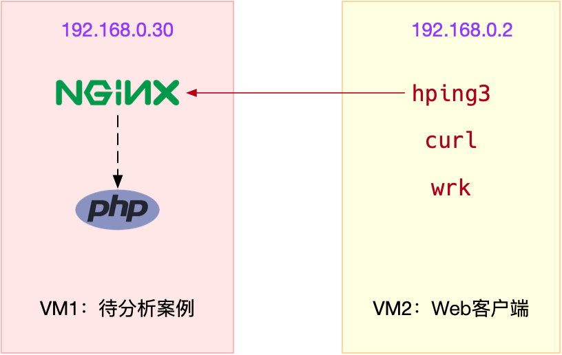
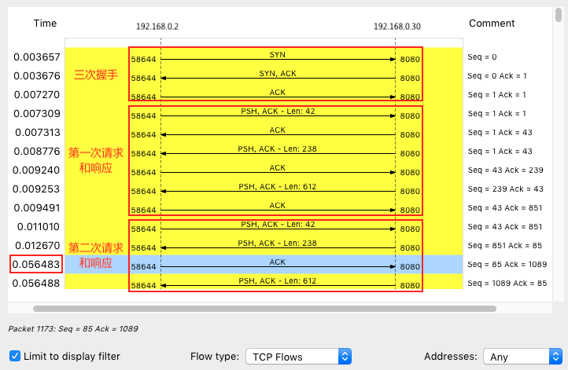

## 案例



```

$ docker run --network=host --name=good -itd nginx
fb4ed7cb9177d10e270f8320a7fb64717eac3451114c9fab3c50e02be2e88ba2
```

```

$ docker run --name nginx --network=host -itd feisky/nginx:latency
b99bd136dcfd907747d9c803fdc0255e578bad6d66f4e9c32b826d75b6812724
```

分别测试案例机器并发 100 时， 80 端口和 8080 端口的性能：
```
# 测试80端口性能
$ # wrk --latency -c 100 -t 2 --timeout 2 http://192.168.0.30/
Running 10s test @ http://192.168.0.30/
  2 threads and 100 connections
  Thread Stats   Avg      Stdev     Max   +/- Stdev
    Latency     9.19ms   12.32ms 319.61ms   97.80%
    Req/Sec     6.20k   426.80     8.25k    85.50%
  Latency Distribution
     50%    7.78ms
     75%    8.22ms
     90%    9.14ms
     99%   50.53ms
  123558 requests in 10.01s, 100.15MB read
Requests/sec:  12340.91
Transfer/sec:     10.00MB
```

```

# 测试8080端口性能
$ wrk --latency -c 100 -t 2 --timeout 2 http://192.168.0.30:8080/
Running 10s test @ http://192.168.0.30:8080/
  2 threads and 100 connections
  Thread Stats   Avg      Stdev     Max   +/- Stdev
    Latency    43.60ms    6.41ms  56.58ms   97.06%
    Req/Sec     1.15k   120.29     1.92k    88.50%
  Latency Distribution
     50%   44.02ms
     75%   44.33ms
     90%   47.62ms
     99%   48.88ms
  22853 requests in 10.01s, 18.55MB read
Requests/sec:   2283.31
Transfer/sec:      1.85MB
```

8080延迟大
抓取 8080 端口上收发的网络包，并保存到 nginx.pcap 文件：
```

$ tcpdump -nn tcp port 8080 -w nginx.pcap

# 测试8080端口性能
$ wrk --latency -c 100 -t 2 --timeout 2 http://192.168.0.30:8080/
```

“Follow” -> “TCP Stream”
Statics -> Flow Graph，选中 “Limit to display filter” 并设置 Flow type 为 “TCP Flows”：


注意，这个图的左边是客户端，而右边是 Nginx 服务器。通过这个图就可以看出，前面三次握手，以及第一次 HTTP 请求和响应还是挺快的，但第二次 HTTP 请求就比较慢了，特别是客户端在收到服务器第一个分组后，40ms 后才发出了 ACK 响应（图中蓝色行）。

看到 40ms 这个值，你有没有想起什么东西呢？实际上，这是 TCP 延迟确认（Delayed ACK）的最小超时时间。

这是针对 TCP ACK 的一种优化机制，也就是说，不用每次请求都发送一个 ACK，而是先等一会儿（比如 40ms），看看有没有“顺风车”。如果这段时间内，正好有其他包需要发送，那就捎带着 ACK 一起发送过去。当然，如果一直等不到其他包，那就超时后单独发送 ACK。因为案例中 40ms 发生在客户端上，我们有理由怀疑，是客户端开启了延迟确认机制。而这儿的客户端，实际上就是前面运行的 wrk。查询 TCP 文档（执行 man tcp），你就会发现，只有 TCP 套接字专门设置了 TCP_QUICKACK ，才会开启快速确认模式；否则，默认情况下，采用的就是延迟确认机制：

验证
```
$ strace -f wrk --latency -c 100 -t 2 --timeout 2 http://192.168.0.30:8080/
...
setsockopt(52, SOL_TCP, TCP_NODELAY, [1], 4) = 0
...
```

Nagle 算法（纳格算法）是 TCP 协议中用于减少小包发送数量的一种优化算法，目的是为了提高实际带宽的利用率。

显然，Nagle 算法本身的想法还是挺好的，但是知道 Linux 默认的延迟确认机制后，你应该就不这么想了。因为它们一起使用时，网络延迟会明显。


* 当 Sever 发送了第一个分组后，由于 Client 开启了延迟确认，就需要等待 40ms 后才会回复 ACK。
* 同时，由于 Server 端开启了 Nagle，而这时还没收到第一个分组的 ACK，Server 也会在这里一直等着。
* 直到 40ms 超时后，Client 才会回复 ACK，然后，Server 才会继续发送第二个分组。

查询 tcp 的文档，你就会知道，只有设置了 TCP_NODELAY 后，Nagle 算法才会禁用。所以，我们只需要查看 Nginx 的 tcp_nodelay 选项就可以了。

```
$ docker exec nginx cat /etc/nginx/nginx.conf | grep tcp_nodelay
    tcp_nodelay    off;
```
案例 Nginx 的 tcp_nodelay 是关闭的，将其设置为 on ，应该就可以解决了。

```

# 删除案例应用
$ docker rm -f nginx

# 启动优化后的应用
$ docker run --name nginx --network=host -itd feisky/nginx:nodelay

```

```

$ wrk --latency -c 100 -t 2 --timeout 2 http://192.168.0.30:8080/
Running 10s test @ http://192.168.0.30:8080/
  2 threads and 100 connections
  Thread Stats   Avg      Stdev     Max   +/- Stdev
    Latency     9.58ms   14.98ms 350.08ms   97.91%
    Req/Sec     6.22k   282.13     6.93k    68.50%
  Latency Distribution
     50%    7.78ms
     75%    8.20ms
     90%    9.02ms
     99%   73.14ms
  123990 requests in 10.01s, 100.50MB read
Requests/sec:  12384.04
Transfer/sec:     10.04MB
```

## 小结

* 使用 hping3 以及 wrk 等工具，确认单次请求和并发请求情况的网络延迟是否正常。
* 使用 traceroute，确认路由是否正确，并查看路由中每一跳网关的延迟。
* 使用 tcpdump 和 Wireshark，确认网络包的收发是否正常。
* 使用 strace 等，观察应用程序对网络套接字的调用情况是否正常。

这样，你就可以依次从路由、网络包的收发、再到应用程序等，逐层排查，直到定位问题根源。
