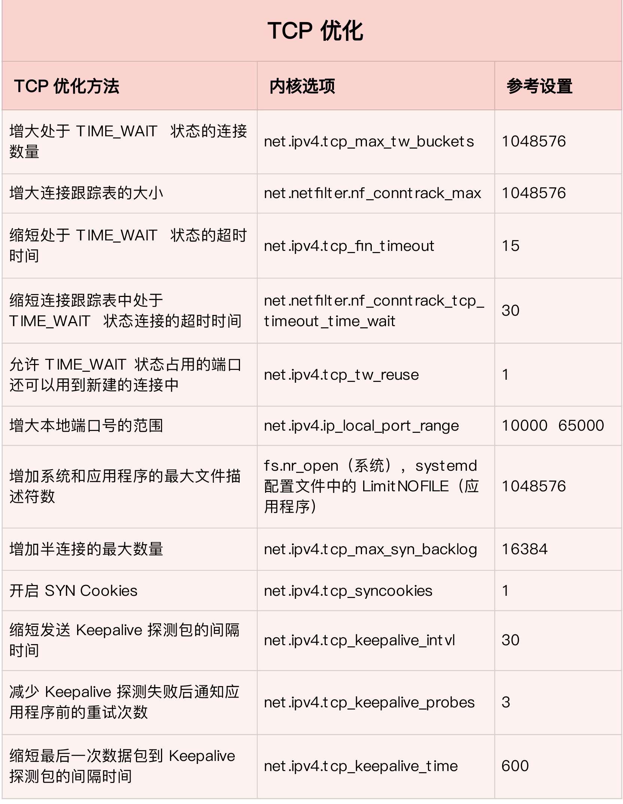

## 复习
* 在应用程序中，主要优化 I/O 模型、工作模型以及应用层的网络协议；
* 在套接字层中，主要优化套接字的缓冲区大小。

## 传输层
第一类，在请求数比较大的场景下，你可能会看到大量处于 TIME_WAIT 状态的连接，它们会占用大量内存和端口资源。这时，我们可以优化与 TIME_WAIT 状态相关的内核选项，比如采取下面几种措施。
* 增大处于 TIME_WAIT 状态的连接数量 net.ipv4.tcp_max_tw_buckets ，并增大连接跟踪表的大小 net.netfilter.nf_conntrack_max。
* 减小 net.ipv4.tcp_fin_timeout 和 net.netfilter.nf_conntrack_tcp_timeout_time_wait ，让系统尽快释放它们所占用的资源。
* 开启端口复用 net.ipv4.tcp_tw_reuse。这样，被 TIME_WAIT 状态占用的端口，还能用到新建的连接中。
* 增大本地端口的范围 net.ipv4.ip_local_port_range 。这样就可以支持更多连接，提高整体的并发能力。
* 增加最大文件描述符的数量。你可以使用 fs.nr_open 和 fs.file-max ，分别增大进程和系统的最大文件描述符数；或在应用程序的 systemd 配置文件中，配置 LimitNOFILE ，设置应用程序的最大文件描述符数。

第二类，为了缓解 SYN FLOOD 等，利用 TCP 协议特点进行攻击而引发的性能问题，你可以考虑优化与 SYN 状态相关的内核选项，比如采取下面几种措施。
* 增大 TCP 半连接的最大数量 net.ipv4.tcp_max_syn_backlog ，或者开启 TCP SYN Cookies net.ipv4.tcp_syncookies ，来绕开半连接数量限制的问题（注意，这两个选项不可同时使用）。
* 减少 SYN_RECV 状态的连接重传 SYN+ACK 包的次数 net.ipv4.tcp_synack_retries。

第三类，在长连接的场景中，通常使用 Keepalive 来检测 TCP 连接的状态，以便对端连接断开后，可以自动回收。但是，系统默认的 Keepalive 探测间隔和重试次数，一般都无法满足应用程序的性能要求。所以，这时候你需要优化与 Keepalive 相关的内核选项，比如：
* 缩短最后一次数据包到 Keepalive 探测包的间隔时间 net.ipv4.tcp_keepalive_time；
* 缩短发送 Keepalive 探测包的间隔时间 net.ipv4.tcp_keepalive_intvl；
* 减少 Keepalive 探测失败后，一直到通知应用程序前的重试次数 net.ipv4.tcp_keepalive_probes。

优化 TCP 性能时，你还要注意，**如果同时使用不同优化方法，可能会产生冲突**。比如，就像网络请求延迟的案例中我们曾经分析过的，服务器端开启 Nagle 算法，而客户端开启延迟确认机制，就很容易导致网络延迟增大。另外，在使用  NAT 的服务器上，如果开启 net.ipv4.tcp_tw_recycle ，就很容易导致各种连接失败。实际上，由于坑太多，这个选项在内核的 4.1 版本中已经删除了。

UDP 提供了面向数据报的网络协议，它不需要网络连接，也不提供可靠性保障。所以，UDP 优化，相对于 TCP 来说，要简单得多。这里我也总结了常见的几种优化方案。
* 跟上篇套接字部分提到的一样，增大套接字缓冲区大小以及 UDP 缓冲区范围；
* 跟前面 TCP 部分提到的一样，增大本地端口号的范围；
* 根据 MTU 大小，调整 UDP 数据包的大小，减少或者避免分片的发生。

## 网络层
网络层，负责网络包的封装、寻址和路由，包括 IP、ICMP 等常见协议。在网络层，最主要的优化，其实就是对路由、 IP 分片以及 ICMP 等进行调优。

第一种，从路由和转发的角度出发，你可以调整下面的内核选项。
* 在需要转发的服务器中，比如用作 NAT 网关的服务器或者使用 Docker 容器时，开启 IP 转发，即设置 net.ipv4.ip_forward = 1。
* 调整数据包的生存周期 TTL，比如设置 net.ipv4.ip_default_ttl = 64。注意，增大该值会降低系统性能。
* 开启数据包的反向地址校验，比如设置 net.ipv4.conf.eth0.rp_filter = 1。这样可以防止 IP 欺骗，并减少伪造 IP 带来的 DDoS 问题。

第二种，从分片的角度出发，最主要的是调整 MTU（Maximum Transmission Unit）的大小。通常，MTU 的大小应该根据以太网的标准来设置。以太网标准规定，一个网络帧最大为 1518B，那么去掉以太网头部的 18B 后，剩余的 1500 就是以太网 MTU 的大小。在使用 VXLAN、GRE 等叠加网络技术时，要注意，网络叠加会使原来的网络包变大，导致 MTU 也需要调整。比如，就以 VXLAN 为例，它在原来报文的基础上，增加了 14B 的以太网头部、 8B 的 VXLAN 头部、8B 的 UDP 头部以及 20B 的 IP 头部。换句话说，每个包比原来增大了 50B。所以，我们就需要把交换机、路由器等的 MTU，增大到 1550， 或者把 VXLAN 封包前（比如虚拟化环境中的虚拟网卡）的 MTU 减小为 1450。另外，现在很多网络设备都支持巨帧，如果是这种环境，你还可以把 MTU 调大为 9000，以提高网络吞吐量。

第三种，从 ICMP 的角度出发，为了避免 ICMP 主机探测、ICMP Flood 等各种网络问题，你可以通过内核选项，来限制 ICMP 的行为。
* 比如，你可以禁止 ICMP 协议，即设置 net.ipv4.icmp_echo_ignore_all = 1。这样，外部主机就无法通过 ICMP 来探测主机。
* 或者，你还可以禁止广播 ICMP，即设置 net.ipv4.icmp_echo_ignore_broadcasts = 1。

## 链路层
网络层的下面是链路层，所以最后，我们再来看链路层的优化方法。链路层负责网络包在物理网络中的传输，比如 MAC 寻址、错误侦测以及通过网卡传输网络帧等。自然，链路层的优化，也是围绕这些基本功能进行的。接下来，我们从不同的几个方面分别来看。

由于网卡收包后调用的中断处理程序（特别是软中断），需要消耗大量的 CPU。所以，将这些中断处理程序调度到不同的 CPU 上执行，就可以显著提高网络吞吐量。

另外，现在的网卡都有很丰富的功能，原来在内核中通过软件处理的功能，可以卸载到网卡中，通过硬件来执行。

最后，对于网络接口本身，也有很多方法，可以优化网络的吞吐量。

## 其他
在单机并发 1000 万的场景中，对 Linux 网络协议栈进行的各种优化策略，基本都没有太大效果。因为这种情况下，网络协议栈的冗长流程，其实才是最主要的性能负担。

这时，我们可以用两种方式来优化。
* 第一种，使用 DPDK 技术，跳过内核协议栈，直接由用户态进程用轮询的方式，来处理网络请求。同时，再结合大页、CPU 绑定、内存对齐、流水线并发等多种机制，优化网络包的处理效率。
* 第二种，使用内核自带的 XDP 技术，在网络包进入内核协议栈前，就对其进行处理，这样也可以实现很好的性能。

## 小结
* 在应用程序中，主要是优化 I/O 模型、工作模型以及应用层的网络协议；
* 在套接字层中，主要是优化套接字的缓冲区大小；
* 在传输层中，主要是优化 TCP 和 UDP 协议；
* 在网络层中，主要是优化路由、转发、分片以及 ICMP 协议；
* 最后，在链路层中，主要是优化网络包的收发、网络功能卸载以及网卡选项。

## 参考资料
>sysctl  https://wiki.archlinux.org/index.php/sysctl
>c - 在Linux中，如何确定optmem_max的最佳值？ https://www.coder.work/article/1879424(optmem_max是一个内核选项，它影响分配给由内核维护的cmsg列表的内存，该列表包含“额外”数据包信息，如SCM_RIGHTS或IP_TTL。)但是Arch Wiki建议optmem_max使用64kb大小，而rmem_max和wmem_max使用16mb大小（这是发送和接收缓冲区）。

## 发现精选留言
>timewait的优化：
>timewait是由主动的一方主动关闭的，我认为应用层最好能够池化这些连接，而不是直接关闭这些链接; 另外，比如对于http有些场景的请求，对于需要关闭链接的情况，多个数据请求最好合并发送，也可以减少timewait的情况. 一半来说，我觉得一个服务器上有1W个左右的timewait的链接还是比较正常的.
>keepAlive，对于长连接的场景，我觉得tcp层是最好不要开. 因为1.tcp默认是7200秒，需要通过更改内核的方式，不知道在何种情况下是合适的. 2:长连接的情况下，应用层也是需要心跳检查的,这个时候tcp层开keepalive话，反而是中浪费.
>tcp层和应用层的网络优化，除了 tcp/ip详解卷一，有一本 effective Tcp/ip programming 也是不错的
>作者回复: 嗯嗯，总结的不错👍
