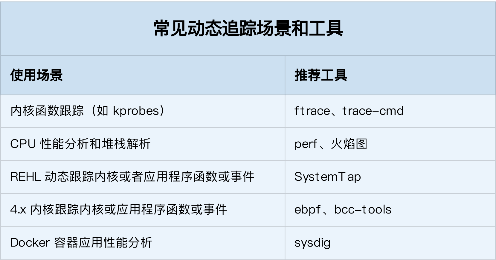

## 如何选择追踪工具

* 在不需要很高灵活性的场景中，使用 perf 对性能事件进行采样，然后再配合火焰图辅助分析，就是最常用的一种方法；
* 而需要对事件或函数调用进行统计分析（比如观察不同大小的 I/O 分布）时，就要用 SystemTap 或者 eBPF，通过一些自定义的脚本来进行数据处理。

在 Linux 系统中，常见的动态追踪方法，包括 ftrace、perf、eBPF 以及 SystemTap 等。在大多数性能问题中，使用 perf 配合火焰图是一个不错的方法。如果这满足不了你的要求，那么：
* 在新版的内核中，eBPF 和 BCC 是最灵活的动态追踪方法；
* 而在旧版本内核中，特别是在 RHEL 系统中，由于 eBPF 支持受限，SystemTap 往往是更好的选择。

此外，在使用动态追踪技术时，为了得到分析目标的详细信息，一般需要内核以及应用程序的调试符号表。动态追踪实际上也是在这些符号（包括函数和事件）上进行的，所以易读易理解的符号，有助于加快动态追踪的过程。

## 参考资料
>原文 https://time.geekbang.org/column/article/86710
