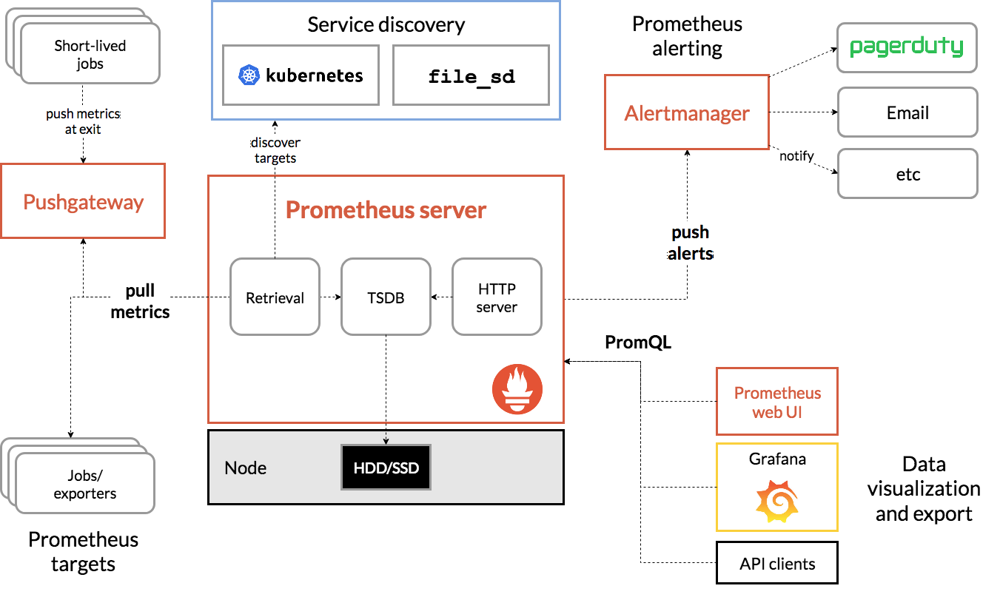

## 监控
要做好监控，最核心的就是全面的、可量化的指标，这包括系统和应用两个方面。

从系统来说，监控系统要涵盖系统的整体资源使用情况，比如我们前面讲过的 CPU、内存、磁盘和文件系统、网络等各种系统资源。

而从应用程序来说，监控系统要涵盖应用程序内部的运行状态，这既包括进程的 CPU、磁盘 I/O 等整体运行状况，更需要包括诸如接口调用耗时、执行过程中的错误、内部对象的内存使用等应用程序内部的运行状况。

## USE
专门用于性能监控的 USE（Utilization Saturation and Errors）法。USE 法把系统资源的性能指标，简化成了三个类别，即使用率、饱和度以及错误数。

* 使用率，表示资源用于服务的时间或容量百分比。100% 的使用率，表示容量已经用尽或者全部时间都用于服务。
* 饱和度，表示资源的繁忙程度，通常与等待队列的长度相关。100% 的饱和度，表示资源无法接受更多的请求。
* 错误数表示发生错误的事件个数。错误数越多，表明系统的问题越严重。

USE 方法只关注能体现系统资源性能瓶颈的核心指标，但这并不是说其他指标不重要。诸如系统日志、进程资源使用量、缓存使用量等其他各类指标，也都需要我们监控起来。只不过，它们通常用作辅助性能分析，而 USE 方法的指标，则直接表明了系统的资源瓶颈。

## 监控系统

