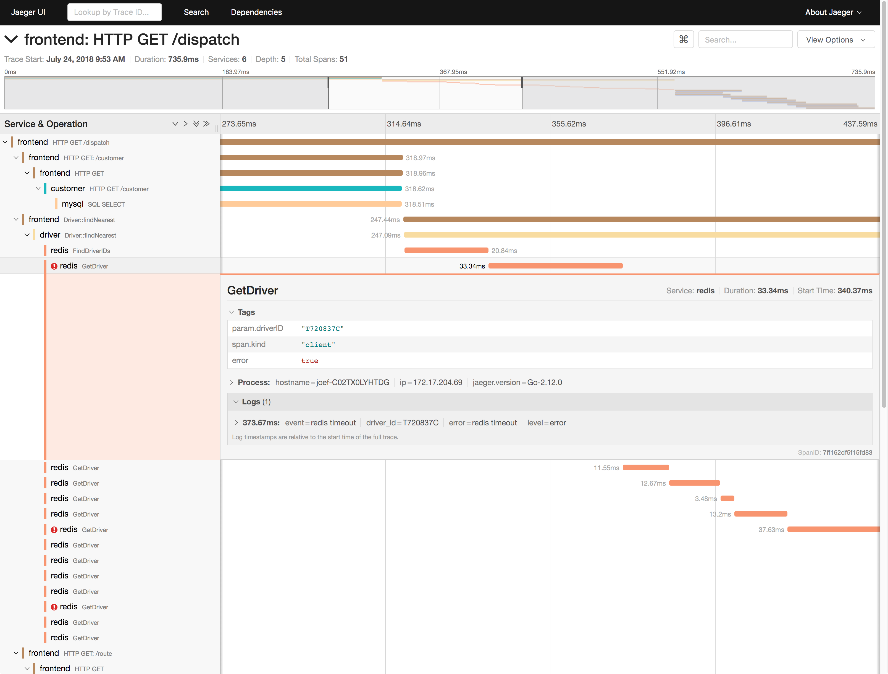
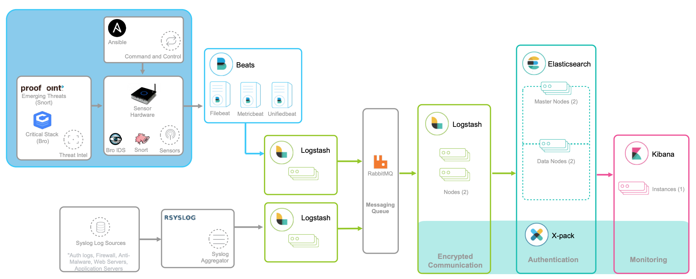

## 指标监控

应用程序的核心指标，不再是资源的使用情况，而是请求数、错误率和响应时间。

第一个，是应用进程的资源使用情况，比如进程占用的 CPU、内存、磁盘 I/O、网络等。使用过多的系统资源，导致应用程序响应缓慢或者错误数升高，是一个最常见的性能问题。

第二个，是应用程序之间调用情况，比如调用频率、错误数、延时等。由于应用程序并不是孤立的，如果其依赖的其他应用出现了性能问题，应用自身性能也会受到影响。

第三个，是应用程序内部核心逻辑的运行情况，比如关键环节的耗时以及执行过程中的错误等。由于这是应用程序内部的状态，从外部通常无法直接获取到详细的性能数据。所以，应用程序在设计和开发时，就应该把这些指标提供出来，以便监控系统可以了解其内部运行状态。

全链路跟踪可以帮你迅速定位出，在一个请求处理过程中，哪个环节才是问题根源。比如，从上图中，你就可以很容易看到，这是 Redis 超时导致的问题。

全链路跟踪除了可以帮你快速定位跨应用的性能问题外，还可以帮你生成线上系统的调用拓扑图。这些直观的拓扑图，在分析复杂系统（比如微服务）时尤其有效。

## 日志监控

对比来看，

* 指标是特定时间段的数值型测量数据，通常以时间序列的方式处理，适合于实时监控。
* 而日志则完全不同，日志都是某个时间点的字符串消息，通常需要对搜索引擎进行索引后，才能进行查询和汇总分析。

对日志监控来说，最经典的方法，就是使用 ELK 技术栈，即使用 Elasticsearch、Logstash 和 Kibana 这三个组件的组合。

* Logstash 负责对从各个日志源采集日志，然后进行预处理，最后再把初步处理过的日志，发送给 Elasticsearch 进行索引。
* Elasticsearch 负责对日志进行索引，并提供了一个完整的全文搜索引擎，这样就可以方便你从日志中检索需要的数据。
* Kibana 则负责对日志进行可视化分析，包括日志搜索、处理以及绚丽的仪表板展示等。

值得注意的是，ELK 技术栈中的 Logstash 资源消耗比较大。所以，在资源紧张的环境中，我们往往使用资源消耗更低的 Fluentd，来替代 Logstash（也就是所谓的 EFK 技术栈）。

## 发现惊险留言
>ELK中采集端还可以使用filebeat,整个架构可以拓展为filebeat-kafka(zookeeper)-logstash或sparkstreaming-es。除了可以做日志查询之外可以做业务关联等
