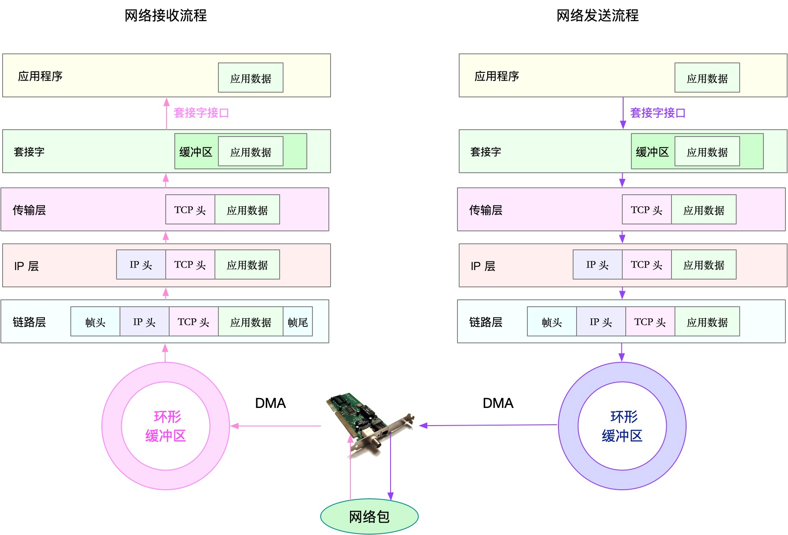

## CPU 性能分析

## 内存性能分析

## 磁盘和文件系统 I/O 性能分析

## 网络性能分析

从系统资源瓶颈的角度来说，USE 法是最为有效的方法，即从使用率、饱和度以及错误数这三个方面，来分析 CPU、内存、磁盘和文件系统 I/O、网络以及内核资源限制等各类软硬件资源。

从应用程序瓶颈的角度来说，我们可以把性能问题的来源，分为资源瓶颈、依赖服务瓶颈以及应用自身瓶颈这三类。资源瓶颈跟系统资源瓶颈，本质是一样的。依赖服务瓶颈，你可以使用全链路跟踪系统进行定位。而应用自身的问题，你可以通过系统调用、热点函数，或者应用自身的指标监控以及日志监控等，进行分析定位。

## 参考资料
>原文https://time.geekbang.org/column/article/88667
