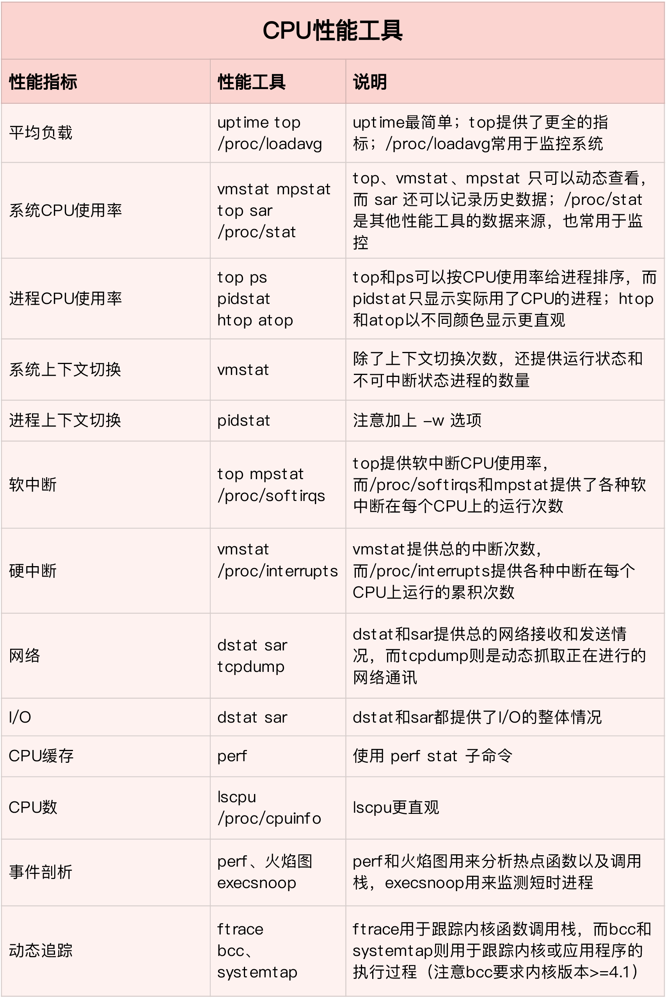
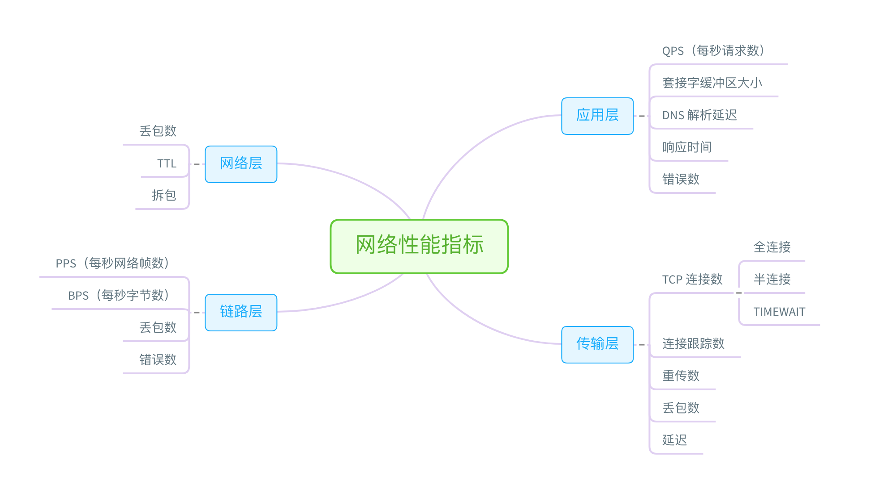

## 性能工具速查
关于工具手册的查看，man 应该是我们最熟悉的方法，我在专栏中多次介绍过。实际上，除了 man 之外，还有另外一个查询命令手册的方法，也就是 info。

info 可以理解为 man 的详细版本，提供了诸如节点跳转等更强大的功能。相对来说，man 的输出比较简洁，而 info 的输出更详细。所以，我们通常使用 man 来查询工具的使用方法，只有在 man 的输出不太好理解时，才会再去参考 info 文档。

要查询手册，前提一定是已知哪个工具可用。如果你还不知道要用哪个工具，就要根据想了解的指标，去查找有哪些工具可用。这其中：
* 有些工具不需要额外安装，就可以直接使用，比如内核的 /proc 文件系统；
* 而有些工具，则需要安装额外的软件包，比如 sar、pidstat、iostat 等。

所以，在选择性能工具时，除了要考虑性能指标这个目的外，还要结合待分析的环境来综合考虑。比如，实际环境是否允许安装软件包，是否需要新的内核版本等。

## CPU 性能工具

## 内存性能工具

## 磁盘 I/O 性能工具

## 网络性能工具

## 基准测试工具
除了性能分析外，很多时候，我们还需要对系统性能进行基准测试。比如，
* 在文件系统和磁盘 I/O 模块中，我们使用 fio 工具，测试了磁盘 I/O 的性能。
* 在网络模块中，我们使用 iperf、pktgen 等，测试了网络的性能。
* 而在很多基于 Nginx 的案例中，我们则使用 ab、wrk 等，测试 Nginx 应用的性能。

Linux 基准测试工具图谱

## 小结
当分析性能问题时，大的来说，主要有这么两个步骤：
* 第一步，从性能瓶颈出发，根据系统和应用程序的运行原理，确认待分析的性能指标。
* 第二步，根据这些图表，选出最合适的性能工具，然后了解并使用工具，从而更快观测到需要的性能数据。

不要把性能工具当成性能分析和优化的全部。
* 一方面，性能分析和优化的核心，是对系统和应用程序运行原理的掌握，而性能工具只是辅助你更快完成这个过程的帮手。
* 另一方面，完善的监控系统，可以提供绝大部分性能分析所需的基准数据。从这些数据中，你很可能就能大致定位出性能瓶颈，也就不用再去手动执行各类工具了。
